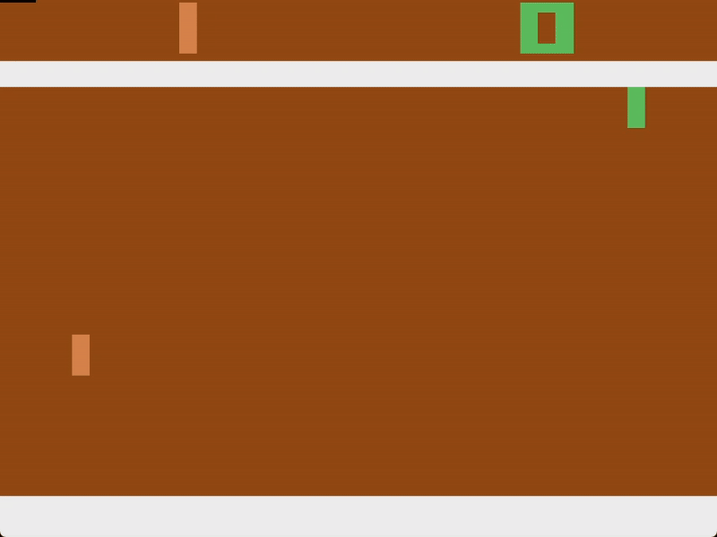
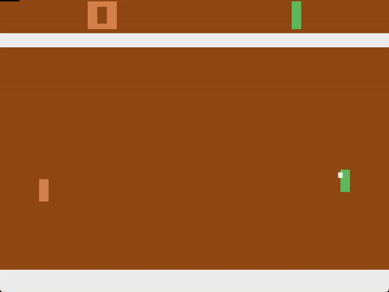

<center>

</center>
<center><p style="font-size: 14px;">Collaborated by: Chachris Martin Kurz (6681003) and Pasin Visuttipinate (6581038)</p></center>

We trained an AI using [NEAT](https://github.com/CodeReclaimers/neat-python/tree/master) (NeuroEvolution of Augmenting Topologies) with two different versions of Pong: [ALE](https://github.com/Farama-Foundation/Arcade-Learning-Environment) version (The Arcade Learning Environment) and Pygame version. Both of these versions allow us to play Pong, but with a few differences in the setup. 

## Pong [ALE](https://github.com/Farama-Foundation/Arcade-Learning-Environment) Version
In this version of the game, we are only allowed to play as the right paddle against a built-in AI which controls the left paddle. Aside from changing how the game is rendered, how small the paddle is, and whether the ball speed is high or low, we are unable to change anything else. 


This is the only code we were given to play around with:
```Python
import gymnasium
import ale_py

gymnasium.register_envs(ale_py)

env = gymnasium.make("ALE/Pong-v5", render_mode="human")
env.reset()
for _ in range(100):
    action = env.action_space.sample()

    obs, reward, terminated, truncated, info = env.step(action)

    if terminated or truncated:
        obs, info = env.reset()

env.close()
```

<center>

</center>

Additionally, the obs only gives us an image frame for each frame of the game, so we have to do image processing to get all the necessary information ourselves, e.g., the ball and paddle location, the ball speed and direction, etc.

## Pong [Pygame](https://github.com/pygame/pygame) Version
In comparison to the ALE version, we are allowed to take complete control over the configuration of the game. This means we can, for example, set the speed of the ball, play as both left and right paddles, or ensure that the initial trajectory of the ball is randomized.

*gif here*

Unlike the ALE version where we have to perform some image processing to acquire necessary information such as ball and paddle locations, this version already gives us all the necessary information.

## The Versions

In total, we have 3 different versions to discuss: 
- “Manually - Planky’s AI (ALE)”
- “ALE NEAT”
- “Pygame NEAT”.


## Manually - Planky’s AI ([ALE](https://github.com/Farama-Foundation/Arcade-Learning-Environment))

When we first got our hands on this version of the game, as part of exploring how to work with the environment, we manually created an “AI” using math. More specifically, using the coordinates of the ball from different frames, we were able to calculate the velocity, how many frames it would take the ball to reach the paddle, as well as the predicted trajectory even after the ball bounces from the top or bottom borders. Using this information, the paddle will decide to move up, down, or not at all. Although there is no actual AI training in this version, the performance is quite good.

<center>

</center>

## [ALE](https://github.com/Farama-Foundation/Arcade-Learning-Environment) [NEAT](https://github.com/CodeReclaimers/neat-python/tree/master)

After learning about neural networks and more specifically NEAT (NeuroEvolution of Augmenting Topologies), we wanted to apply it to the ALE version in hope of creating an actual AI capable of winning against the built-in AI.

### The process is as follows:
<ol>
    <li>The networks are given 6 different information:
        <ol type="a">
            <li>Y-coordinate of right paddle</li>
            <li>Y-coordinate of the ball</li>
            <li>Distance from the right paddle to the ball</li>
            <li>Velocity of the ball</li>
            <li>Velocity of the right paddle</li>
            <li>Action performed prior (eg. move up, down, or stay still)</li>
        </ol
    </li>
    <li>NEAT starts with a population of 50 genomes</li>
    <li>Each genome’s fitness is evaluated based on how many times it successfully hits the ball</li>
    <li>The fittest genomes are selected for reproduction</li>
    <li>The offsprings undergo some random mutations</li>
    <li>This process is then repeated until we achieve the desired result</li>
</ol>

### An issue encountered:

We were able to successfully train the AI to beat the built-in AI opponent, but our AI has managed to do this by figuring out that the enemy AI is perfectly predictable. An issue with the ALE version is that the ball always spawn with the same trajectory toward the enemy AI, and the enemy AI will always respond in the same exact way. As such, through training, our AI has learned to stay in one spot where the enemy AI will keep losing. 

*insert gif here of the no movement cheese spot*

### Enforcing no cheese spot rule:

To discourage this behavior, we would modify the reward system after a few generations of training. First, we would add a condition where if it stands still, it will not get rewarded, but by doing this, there is a chance it will miss the ball from moving too much. That is why after training it for a few generations, where it now knows that it needed to move to hit the ball, we would remove the condition so it can slow down and stand still to hit the ball back reliably.

*insert gif here of very cool gameplay*

## [Pygame](https://github.com/pygame/pygame) [NEAT](https://github.com/CodeReclaimers/neat-python/tree/master)

Lastly, we wanted to see if we could train the AIs of both left and right paddles against each other, and additionally see how good of an opponent it would be against a human. Since the ALE version restricts us to only play as the right paddle, we had to move over to this Pygame version of Pong. 

*insert Pygame version of pong here*

The training process here is practically the same as in the ALE NEAT version. Since we have two of our own networks fighting each other, though, each iteration of training initializes two genomes and the fitness of both are evaluated based on how many times they manage to hit the ball back. 

In the end, we managed to successfully train an AI that could effectively play against other AIs, as well as actual humans. However, the randomness of humans meant that the AI performed worse against humans compared to other AIs. After the AI was allowed to train for more generations, though, it has become practically unbeatable. 

*insert Pygame version of AI playing fast version*

## Citations
- *A. McIntyre, M. Kallada, C. G. Miguel, C. Feher de Silva, M. L. Netto. {[neat-python](https://github.com/CodeReclaimers/neat-python/tree/master)}*
- *M. C. Machado, M. G. Bellemare, E. Talvitie, J. Veness, M. J. Hausknecht, M. Bowling. Revisiting the [Arcade Learning Environment](https://github.com/Farama-Foundation/Arcade-Learning-Environment): Evaluation Protocols and Open Problems for General Agents, Journal of Artificial Intelligence Research, Volume 61, pages 523-562, 2018.*
